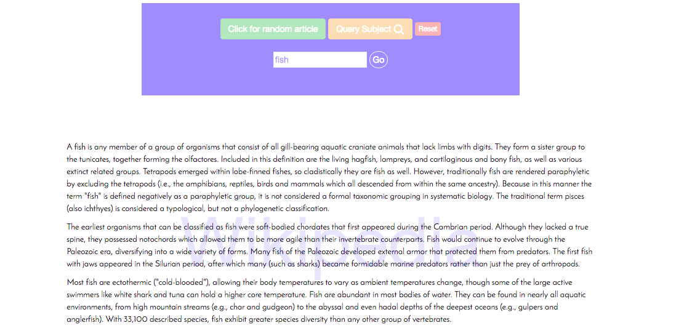

# [wikipediaViewer](http://codepen.io/David_Eliason/pen/RaVNpa)  

Either randomly chooses subject from Wikipedia or searches the api for the query parameters.

### March 22, 2016
### Written By: [David Eliason](http://www.davethemaker.com)

### Technologies Used:

 HTML5, CSS3, jQuery, Javascript, AJAX, API.

#### To view code and test it out:  [Codepen.io](http://codepen.io/David_Eliason/pen/RaVNpa)  

[Return to Portfolio](https://davideliason.github.io/)

##### 2016 Copyright David Eliason. All Rights Reserved.